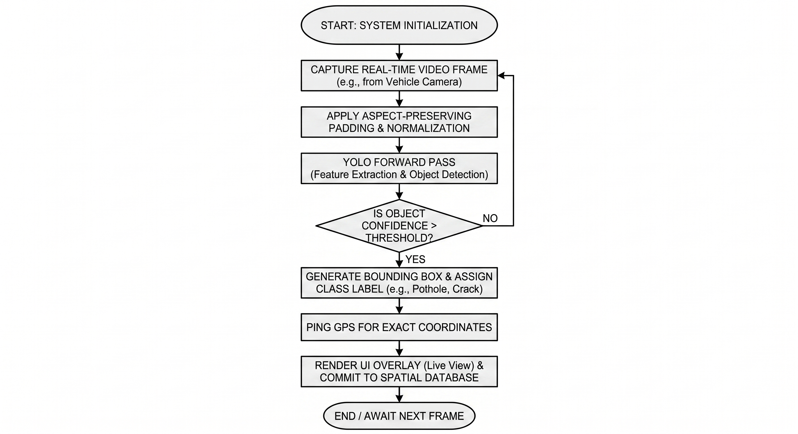
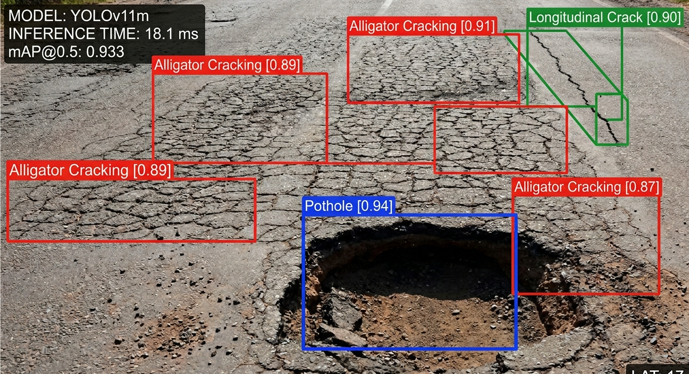

# 🛣️ Integrated YOLO-Based Road Damage Detection Framework
> **Automated Infrastructure Monitoring using Deep Learning (YOLOv8/v10/v11)**

[](https://www.python.org/)
[](https://streamlit.io/)
[](https://github.com/ultralytics/ultralytics)

---

## 🌟 Project Overview
This project addresses the critical challenge of road infrastructure decay by providing a real-time, AI-powered detection system. Leveraging a custom dataset of **12,450 annotated images** of Indian roads, the system detects and classifies four distress patterns: **Potholes**, **Alligator Cracking**, **Longitudinal Cracking**, and **Lateral Cracking**. 

The framework is optimized for **real-time edge deployment**, allowing for continuous scanning and geospatial logging on vehicle-mounted hardware.

---

## 🏗️ System Architecture & Workflow
The framework utilizes a modular Edge Processing Engine (YOLO Inference Core), achieving NMS-free inference on vehicle-mounted hardware for continuous infrastructure scanning.




---

## 🖼️ Detection Results
| Input Frame | AI Detection Overlay |
| :--- | :--- |
|  |  |
> *Detection result on a severe pothole with a confidence score of 0.94 and various cracking patterns.*

## 🗺️ Performance Metrics & Benchmarking
The system supports multiple architectures. Benchmarking reveals that **YOLOv11m** provides the highest accuracy, while **YOLOv10m** offers the best latency for edge deployment.

| Model | mAP@0.5 | Inference Latency (ms) | Recommendation |
| :--- | :--- | :--- | :--- |
| **YOLOv8m** | 0.884 | 18.5 | Baseline |
| **YOLOv10m** | 0.921 | **15.6** | **Best for Edge** |
| **YOLOv11m** | **0.933** | 18.1 | **Best Accuracy** |

---

## 🚀 Getting Started

Ensure you have the model weights (`best.pt`) in the root directory.

1. **Clone the repository:**
   ```bash
   git clone [https://github.com/saikiranthipirisetti/Road-Damage-Detection-AI.git](https://github.com/saikiranthipirisetti/Road-Damage-Detection-AI.git)
   cd Road-Damage-Detection-AI
   pip install -r requirements.txt
   streamlit run app.py
   
